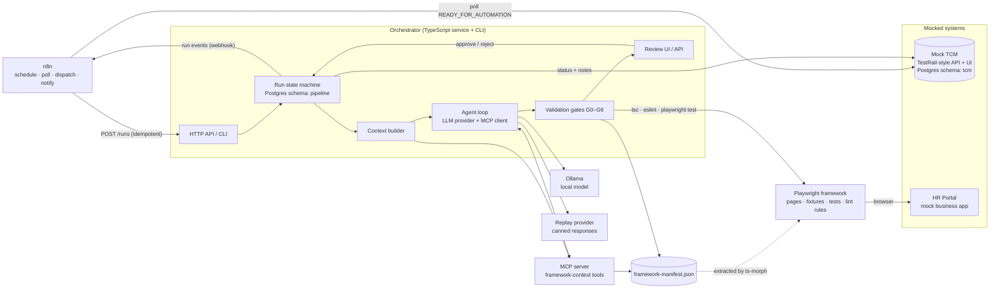

# ai-qa-pipeline

[](https://github.com/latczar/agentic-qa-tcm/actions/workflows/ci.yml)

Local, free, AI-assisted Playwright test generation with deterministic validation and human review.

A TestRail-style mock TCM holds manual test cases. When a tester marks one Ready for Automation, n8n notices and dispatches it to a TypeScript orchestrator. The orchestrator builds context about the test framework through an MCP server, asks a local model (Ollama) for a structured test, runs the result through six validation gates (response schema, framework structure, symbol existence, TypeScript, ESLint, real Playwright execution — twice, to catch flakiness), retries with specific feedback when a gate fails, and parks the candidate for a human to approve or reject before the TCM is updated and the reviewer is emailed.

Full design in [docs/ARCHITECTURE.md](docs/ARCHITECTURE.md), the reasoning behind each contested decision in [docs/adr](docs/adr), and an interview-ready Q&A trail of what was actually found while building it in [docs/talking-points.md](docs/talking-points.md).

## Why this is not "send a prompt, get a test"

The model is one component in a system that would still be worth building if the model were swapped out entirely. Everything around it is ordinary, testable software:

- **Deterministic gates, not model opinion.** A generated test is accepted only if it passes schema validation, a static structure check, symbol-existence checking against the real framework, `tsc`, ESLint, and two real runs of the actual Playwright suite against the actual application. The model never gets a vote on whether its own test is correct.
- **A replay provider stands in for the model everywhere except real use.** The entire retry policy, every failure class, idempotency, and the human review flow are proven by a 12-scenario test matrix that runs in about two minutes with no LLM present — see [ADR-0004](docs/adr/0004-replay-provider-for-deterministic-testing.md).
- **Context retrieval is a lookup table and keyword overlap, not embeddings.** The framework is small and structured enough that a vector database would be solving a problem this project doesn't have. See [ADR-0003](docs/adr/0003-no-embeddings-deterministic-retrieval-instead.md).
- **A human decides, not a threshold.** Every candidate that passes every gate still waits for a person to approve or reject it before anything is promoted into the real suite or reported back to the TCM.
- **Nothing is stubbed inside the validation path.** If a gate says a test passes, it ran in a real browser against the real (mock) application.

## Architecture



## Quickstart

```bash
npm ci
docker compose up -d          # Postgres, n8n, Mailpit
npm run dev -w apps/mock-tcm  # :4000
npm run dev -w apps/hr-portal # :3000
```

Then start the orchestrator against the replay provider (no model install required to see the whole loop work):

```bash
EVENTS_WEBHOOK_URL=http://localhost:5678/webhook/run-events \
LLM_PROVIDER=replay LLM_SCENARIO=happy \
npm run dev -w packages/orchestrator  # :5000
```

Open the mock TCM (http://localhost:4000/cases), mark a case Ready for Automation, and within two minutes:

1. n8n's poll-and-dispatch workflow finds it and calls the orchestrator — no manual step.
2. The orchestrator builds context, asks the model, validates the result, and lands it at `PENDING_REVIEW`.
3. n8n emails the reviewer (check Mailpit at http://localhost:8025).
4. Approve or reject at the review inbox (http://localhost:5000/review) — approve promotes the file into the real Playwright suite and updates the TCM to `AUTOMATED`.

To use a real model instead of the replay provider, install [Ollama](https://ollama.com), `ollama pull qwen2.5-coder:7b`, and set `LLM_PROVIDER=ollama` — see the honest results below before expecting it to pass on the first try.

## Failure gallery

Twelve deliberate failure fixtures under `scenarios/`, each a real test in `packages/orchestrator/src/pipeline/pipeline.integration.test.ts` running the actual pipeline against real Postgres, `tsc`, ESLint and Playwright — no mocking inside the gates themselves.

| Scenario                                                 | What the model does                                                  | Caught by                            | Outcome                                                                     |
| -------------------------------------------------------- | -------------------------------------------------------------------- | ------------------------------------ | --------------------------------------------------------------------------- |
| [`happy`](scenarios/happy)                               | Produces a correct test first time                                   | all gates pass                       | `PENDING_REVIEW` on attempt 1                                               |
| [`malformed-then-valid`](scenarios/malformed-then-valid) | Truncated JSON, then a valid response                                | G0 (response contract)               | repaired on attempt 2, `PENDING_REVIEW`                                     |
| [`structure-violation`](scenarios/structure-violation)   | Imports `@playwright/test` directly, drives `page`, hard-codes a URL | G1 (structural policy)               | retried with the violated rules quoted, `PENDING_REVIEW`                    |
| [`wrong-tag`](scenarios/wrong-tag)                       | Tags the test with a different case id                               | G1 (structural policy)               | retried, `PENDING_REVIEW`                                                   |
| [`unknown-method`](scenarios/unknown-method)             | Invents a method (`submitLeave`) that doesn't exist                  | G2 (symbol existence)                | retried with a "did you mean" hint, `PENDING_REVIEW`                        |
| [`unknown-locator`](scenarios/unknown-locator)           | Asserts on a locator (`balanceBadge`) that doesn't exist             | G2 (symbol existence)                | retried with the real helper name, `PENDING_REVIEW`                         |
| [`type-error`](scenarios/type-error)                     | Passes a number where a string is required                           | G3 (`tsc`)                           | retried with trimmed diagnostics, `PENDING_REVIEW`                          |
| [`trivial-assertion`](scenarios/trivial-assertion)       | Replaces the real assertion with `expect(true).toBe(true)`           | G4 (ESLint, `no-trivial-assertions`) | retried, `PENDING_REVIEW`                                                   |
| [`execution-failure`](scenarios/execution-failure)       | Structurally perfect code that asserts the wrong value               | G5 (real Playwright execution)       | fails in the browser on attempt 1, corrected on attempt 2, `PENDING_REVIEW` |
| [`flaky`](scenarios/flaky)                               | Passes once, fails on the required repeat run                        | G5 (executed twice on purpose)       | `NEEDS_ATTENTION` — a flaky test is a finding, never silently retried       |
| [`exhausted`](scenarios/exhausted)                       | Keeps inventing the same broken method on every attempt              | G2, three times running              | `NEEDS_ATTENTION` after 3 attempts, best attempt kept for a human           |
| [`llm-unavailable`](scenarios/llm-unavailable)           | The model server doesn't respond                                     | provider health check                | `DEFERRED` with no attempt spent, case stays claimed, event emitted         |

## Results against a real local model

Benchmarked honestly against `qwen2.5-coder:7b` (free, local, GPU-accelerated) on the four ready-for-automation cases, in both curated and agentic mode: **0 of 8 runs reached review.** That's a genuine result for a free 7B model, not a pipeline defect — every single attempt was stopped by a specific, correct gate (an invented method, a mis-structured test, an unused import), and two real bugs in the pipeline's own hint-generation logic were found and fixed while diagnosing why. Retrying also didn't reliably fix a structural mistake: one case's three attempts were byte-for-byte identical even after the retry hint pointed at the exact right fix.

Full write-up, numbers and the two bugs found: [docs/results.md](docs/results.md).

## Design decisions

- [ADR-0001](docs/adr/0001-hand-built-mocks-over-kiwi-and-orangehrm.md): hand-built mocks instead of Kiwi TCMS or OrangeHRM.
- [ADR-0002](docs/adr/0002-n8n-as-thin-glue-not-the-brain.md): n8n is scheduling glue, not the agent.
- [ADR-0003](docs/adr/0003-no-embeddings-deterministic-retrieval-instead.md): deterministic retrieval instead of embeddings.
- [ADR-0004](docs/adr/0004-replay-provider-for-deterministic-testing.md): a replay provider is the primary way the pipeline is tested.
- [ADR-0005](docs/adr/0005-framework-manifest-as-single-source-of-truth.md): the framework manifest is a committed, drift-checked artefact.

## Honest limitations

- **The free local model rarely passes from scratch.** See Results above. The gates and human review exist precisely because of this, not despite it.
- **Context retrieval is rule-based and would need rework at scale.** Fine for one framework with a dozen page objects; the keyword-overlap heuristic degrades as the vocabulary gets noisier on a much larger codebase (ADR-0003).
- **No sabotage gate (G6) yet.** The plan called for a stretch gate that deliberately breaks the application under test and checks that a generated test actually notices — not built. The HR Portal already has the sabotage header wired in (`X-Sabotage: leave.submit`); nothing yet drives it from the pipeline.
- **hr-portal, mock-tcm and the orchestrator run on the host, not in Compose.** Only Postgres, n8n and Mailpit are containerised. A "full compose" mode (orchestrator image based on the official Playwright image, so browsers are present) is the natural next step, not yet built.
- **Single reviewer, no auth.** The review UI and n8n itself have no real user accounts. Fine for a local demo; a real deployment needs both.
- **DEFERRED runs have no automatic resumption path.** If a run defers (model briefly unavailable) and is never retried, it sits there — discovered while testing this project, not designed for.

## What's next

- G6 sabotage gate: mutate the HR Portal via its sabotage header and confirm a generated test actually fails when the feature it's testing is broken.
- Full Docker Compose mode: hr-portal, mock-tcm and the orchestrator as containers, so `docker compose up` alone is the entire quickstart.
- A TCM MCP server, so an IDE agent could query manual test case state the same way the orchestrator queries the framework.
- Branch-based review: promote an approved candidate to a git branch instead of a direct file move, so review can happen as a normal pull request.

## Prerequisites

- Node 24 (see `.nvmrc`)
- Docker Desktop with WSL 2 on Windows, or Docker Engine with Compose v2 elsewhere
- [Ollama](https://ollama.com) if you want to run a real model rather than the replay provider

## Checks

```bash
npm run lint
npm run typecheck
npm test               # unit
npm run test:e2e       # Playwright suite against the HR Portal
npm run test:integration  # needs Postgres; the 12-scenario matrix + TCM repository tests
npm run manifest:check
npm run format:check
docker compose config -q
```

## Layout

```
apps/         mock systems: hr-portal (system under test), mock-tcm (TestRail stand-in)
packages/     shared types, e2e-framework, framework-manifest, mcp-server, orchestrator
docker/       container init scripts
docs/         architecture, decision records, results, talking points
n8n/import/   workflows and the Mailpit credential, auto-imported on docker compose up
scenarios/    deliberate failure-scenario fixtures, run as real tests
prompts/      versioned prompt templates
```
