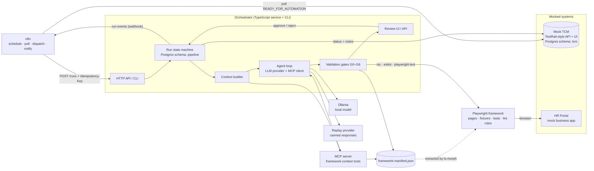

# Architecture: AI-assisted Playwright test generation pipeline

Status: v0.2, 15 September 2026. Phase 0 is implemented. The decisions in section 17 are settled; the reasoning behind the larger ones lives in `docs/adr`.

## 1. What this project is

A local, free, end-to-end workflow that takes manual test cases marked "Ready for Automation" in a TestRail-style test case management tool (TCM), generates Playwright TypeScript tests that fit an existing framework, validates them with deterministic gates, and accepts them only after human review.

The language model is one component. Everything around it (context selection, tool exposure through MCP, output contracts, validation, retries, idempotency, review, reporting) is ordinary, testable software.

### Design principles

1. **The model proposes, the pipeline disposes.** Acceptance decisions are made by deterministic code or a human, never by the model.
2. **Read tools for the model, write actions for the orchestrator.** MCP exposes read-only framework context. File writes, test execution and TCM updates are owned by code.
3. **Cheapest check first.** Gates run in cost order: response schema, static policy, symbol existence, TypeScript, ESLint, Playwright.
4. **Every run is reproducible and explainable.** Prompt version, model, context receipt, raw response, gate results and artefacts are persisted per attempt.
5. **Runnable without the model.** A replay provider serves canned responses so CI and tests exercise the whole pipeline, including every failure scenario, with no LLM present.
6. **Boring technology.** Express, Postgres, Playwright, zod, ts-morph. No vector database, no cloud services, no paid APIs, no Kubernetes, no Redis, no message queues. Infrastructure is added only when a concrete need appears.

## 2. System overview



### How the pieces talk

| From         | To           | Protocol                 | Notes                                                       |
| ------------ | ------------ | ------------------------ | ----------------------------------------------------------- |
| n8n          | Mock TCM     | HTTP                     | Poll cases, TestRail-shaped endpoints                       |
| n8n          | Orchestrator | HTTP                     | `POST /runs` with `Idempotency-Key: <caseId>:<version>`     |
| Orchestrator | Mock TCM     | HTTP                     | Status updates, notes, automation reference                 |
| Orchestrator | MCP server   | MCP over stdio (spawned) | Real MCP SDK. HTTP transport also available for IDE clients |
| Orchestrator | Ollama       | HTTP                     | `/api/chat` with tools and JSON schema format               |
| Orchestrator | Framework    | child processes          | `tsc --noEmit`, `eslint`, `playwright test`                 |
| Framework    | HR Portal    | browser                  | `baseURL` from config, `data-testid` locators               |
| Orchestrator | n8n          | HTTP webhook             | Emits run events for notifications                          |

## 3. Components and responsibilities

### 3.1 HR Portal (`apps/hr-portal`), the system under test

A small server-rendered employee portal. Express + EJS templates + a little vanilla JavaScript for validation and modals. In-memory store with a deterministic seed.

- Features: login (employee, manager, admin roles), employees (list, view, create, edit, deactivate), leave requests (create, list, cancel), expenses (submit with amount, category, description; list), manager approvals (approve or reject leave and expenses with a comment), dashboard.
- Every interactive element has a stable `data-testid`, and rows carry the record id, for example `leave-row-lr-001`.
- Validation is server-side only. Browser validation attributes are left off so every error message can be reached and asserted by a test.
- Test-support endpoints, disabled unless `TEST_MODE=true`: `POST /__test__/reset`, `POST /__test__/seed`, `GET /health`.
- Sabotage flags (stretch, see gate G6): an `X-Sabotage: leave.submit` header makes a feature silently fail to persist, so a test that still passes has proved nothing.

Why server-rendered: fewer moving parts, fast tests, and it keeps attention on the pipeline rather than a front-end build.

### 3.2 Mock TCM (`apps/mock-tcm`), the TestRail stand-in

Express + Postgres (`tcm` schema). REST API shaped like TestRail's, plus a minimal UI to browse cases and flip status by hand (the manual trigger for demos).

- Case fields: id (`TC-014`), title, feature tag, priority, preconditions, steps (action + expected result), test data, `automation_status`, `automation_ref`, `automation_run_id`, `automation_note`, `version`.
- `version` increments on any edit. A new version of an already automated case is a new generation event.
- Statuses owned by humans: `NOT_PLANNED`, `READY_FOR_AUTOMATION`. Owned by the pipeline: `AUTOMATION_IN_PROGRESS`, `PENDING_REVIEW`, `AUTOMATED`, `NEEDS_ATTENTION`.
- Atomic claim endpoint: `POST /cases/:id/claim` runs `UPDATE ... WHERE status = 'READY_FOR_AUTOMATION' AND version = $v RETURNING`, so two pollers cannot both win.
- Seeded from `apps/mock-tcm/seed/test-cases/*.yaml`: around 20 realistic manual cases (about 4 per feature), all with synthetic data.

### 3.3 Playwright framework (`packages/e2e-framework`), the framework the AI must fit into

An opinionated framework of the kind a real team would own. Built and tested before any AI work.

- `pages/`: `BasePage`, `LoginPage`, `DashboardPage`, `EmployeesPage`, `LeaveRequestsPage`, `ExpensesPage`, `ApprovalsPage`. Page objects expose typed `readonly` locators and intention-revealing methods with JSDoc.
- `fixtures/`: custom `test` extending Playwright's with `app` (page object bundle), `loggedInAs(role)`, `api` (seed/reset client), `testData` builders.
- `tests/e2e/<feature>/`: 8 to 10 handwritten exemplar tests, the "existing patterns" the agent learns from. Each carries a `@TC-xxx` tag.
- `tests/generated/`: candidates awaiting review. Excluded from the main suite.
- `eslint/rules/`: custom rules that encode the conventions: `no-raw-locators-in-tests`, `no-trivial-assertions`, `require-test-case-tag`, `no-hardcoded-urls`. Plus the community Playwright ESLint plugin for `.only`, `waitForTimeout`, and so on.
- `CONVENTIONS.md`: the short human-readable rulebook. The MCP server serves it verbatim.

### 3.4 Framework manifest (`packages/framework-manifest`)

A ts-morph extractor that parses the framework and writes `framework-manifest.json`: page objects with their public methods (name, parameters, return type, JSDoc) and locators (name, selector); fixtures; helpers; example tests with tags; conventions.

The same manifest feeds both the MCP server (what the model can see) and the validators (what the model is allowed to use). A CI job regenerates it and fails on drift.

### 3.5 MCP server (`packages/mcp-server`)

Exposes framework context as small, typed, read-only tools. Runs over stdio for the pipeline and over HTTP so the same server can be added to Claude Code or Claude Desktop for a side-by-side demo.

Tools (inputs validated with zod, schemas published as JSON Schema):

| Tool                                    | Purpose                                  | Output shape                                        |
| --------------------------------------- | ---------------------------------------- | --------------------------------------------------- |
| `list_page_objects()`                   | Names and one-line summaries             | compact list                                        |
| `get_page_object(name, includeSource?)` | Methods, signatures, locators, JSDoc     | signatures by default, source on request            |
| `list_fixtures()`                       | Fixture names, types, descriptions       | compact list                                        |
| `get_conventions()`                     | `CONVENTIONS.md`                         | text                                                |
| `find_examples(feature, limit?)`        | Exemplar tests for a feature             | paths + titles + tags                               |
| `get_example(path)`                     | Source of one exemplar test              | text                                                |
| `search_symbols(query)`                 | Fuzzy search across methods and locators | ranked matches, with "did you mean" for near misses |

Tool design rules: read-only; compact by default; bounded outputs; errors that name the nearest valid alternative; no tool that writes files, runs tests or updates the TCM.

### 3.6 Orchestrator (`packages/orchestrator`), the pipeline

The heart of the system. A TypeScript service with an HTTP API and a CLI that share the same core, so the pipeline runs identically from n8n, from a terminal, and in CI.

Modules:

- **Run state machine** with Postgres persistence (`pipeline` schema). Tables: `generation_runs`, `generation_attempts`, `review_decisions`. Unique index on `(test_case_id, test_case_version)`.
- **TCM client** behind an interface, so tests use an in-memory fake.
- **Context builder**: assembles the prompt within a token budget (section 5).
- **LLM provider interface** with three implementations: `OllamaProvider`, `ReplayProvider` (canned responses from `scenarios/`), `FailingProvider` (for chaos tests).
- **Agent loop**: MCP client, tool-call handling with a cap per attempt, structured output parsing.
- **Gates** G0 to G6 (section 7) producing a structured `GateReport`.
- **Retry policy** (section 8).
- **Runners**: thin wrappers around `tsc`, `eslint` and `playwright test` as child processes, with parsed output.
- **Review API and UI**: list pending candidates, show diff, gate report and Playwright report, approve or reject with a comment. Plain server-rendered HTML.
- **Artefact store**: `artifacts/runs/<runId>/attempt-<n>/` holding prompt, raw response, generated spec, gate report, Playwright report and trace. Git-ignored locally, uploaded in CI.
- **Event emitter**: webhooks to n8n on `run.pending_review`, `run.needs_attention`, `run.approved`, `run.deferred`.

### 3.7 n8n (`n8n/`)

Local n8n in Docker, used as the scheduling and integration layer, not as the brain. Workflows are exported as JSON and auto-imported on `docker compose up`.

n8n keeps its own state (workflows, credentials, encryption key) in SQLite inside its Docker volume. It does not use the project's Postgres, so it needs no database configuration and cannot be confused with the pipeline's own state. Switching it to Postgres is six environment variables if that is ever needed.

- **Workflow A, poll and dispatch**: Schedule trigger (every 2 minutes) → fetch `READY_FOR_AUTOMATION` cases → for each, `POST /runs` with an idempotency key → log created versus duplicate.
- **Workflow B, event router**: Webhook receives run events → routes to notifications (an email to the reviewer, caught locally by Mailpit, an SMTP catcher with a web UI and REST API) and any extra TCM annotations.

The orchestrator is the source of truth for run state. n8n is stateless glue. This avoids two systems disagreeing about where a run is, and it means the whole pipeline is testable in CI without n8n.

### 3.8 Ollama

Local model server, run on the host rather than in Compose. Model is configurable. Start with a current coder model in the Qwen coder family. The development machine has 24 GB of unified memory, so a 7B model is the default and a 14B model is worth trying. GPU acceleration on the AMD Radeon 8060S is checked in phase 6; CPU inference works regardless, just more slowly. The provider checks `GET /api/tags` before each run and treats failure as `LLM_UNAVAILABLE`. If the chosen model does not support tool calling, the agent loop falls back to curated context mode automatically.

## 4. End-to-end flow

1. A tester sets `TC-014` to `READY_FOR_AUTOMATION` in the mock TCM.
2. n8n polls, finds it, and calls `POST /runs` with `Idempotency-Key: TC-014:3`.
3. Orchestrator checks the unique index. Existing run → `200 duplicate`, nothing else happens. New → claims the case atomically in the TCM (status `AUTOMATION_IN_PROGRESS`), creates the run, responds `202`.
4. Context builder fetches the case, ranks framework context by feature tag, asks the MCP server for the selected page objects, fixtures, conventions and one or two exemplar tests, and writes a context receipt.
5. Agent loop sends the prompt to the provider. In agentic mode the model may call MCP tools (capped at 6 calls). The final answer must be JSON matching `GeneratedTestSchema`.
6. Gates run in order. First failure produces a structured error list.
7. Retry policy decides: repair, regenerate with feedback, defer, or stop.
8. On success the candidate spec is written to `tests/generated/`, the Playwright report is stored, the run moves to `PENDING_REVIEW`, the TCM is updated, and an event is emitted.
9. A human opens the review UI, reads the diff and reports, and approves or rejects.
10. Approve → file is promoted to `tests/e2e/<feature>/`, TCM becomes `AUTOMATED` with `automation_ref` set. Reject → TCM becomes `NEEDS_ATTENTION` with the reviewer's comment, and the best attempt is kept for a human to finish.

### Run state machine

```
QUEUED → BUILDING_CONTEXT → GENERATING → VALIDATING → EXECUTING → PENDING_REVIEW → APPROVED
                                 │             │            │                        └→ REJECTED
                                 │             └────────────┴→ (retry) → GENERATING
                                 │                          └→ NEEDS_ATTENTION
                                 └→ DEFERRED (LLM unavailable, re-queued with backoff)
```

TCM mapping: `QUEUED` to `EXECUTING` → `AUTOMATION_IN_PROGRESS`; `PENDING_REVIEW` → `PENDING_REVIEW`; `APPROVED` → `AUTOMATED`; `REJECTED` and `NEEDS_ATTENTION` → `NEEDS_ATTENTION`; `DEFERRED` → stays `AUTOMATION_IN_PROGRESS` with a note.

## 5. Context management

The prompt is assembled from ranked, budgeted sections. Local models have small context windows, so this matters more than with hosted models.

| Section             | Source            | Selection                                                                                             | Budget        |
| ------------------- | ----------------- | ----------------------------------------------------------------------------------------------------- | ------------- |
| Conventions summary | `CONVENTIONS.md`  | always                                                                                                | ~400 tokens   |
| Test case           | TCM, normalised   | always                                                                                                | as needed     |
| Fixtures            | manifest          | always                                                                                                | ~300 tokens   |
| Page objects        | manifest via MCP  | `LoginPage` always, plus those whose feature tag matches the case, then by keyword overlap with steps | ~2,500 tokens |
| Exemplar tests      | framework via MCP | 1 or 2 with the same feature tag                                                                      | ~1,500 tokens |
| Retry feedback      | previous attempt  | only the structured error list and the previous code, never the full history                          | ~1,000 tokens |

Rules:

- Total budget is configurable per model (default 6,000 tokens of input for a 7B model). Estimation uses a characters-per-token heuristic, recorded as such.
- Truncation order when over budget: drop the second exemplar, then trim JSDoc, then drop non-matching page objects. Never truncate the test case.
- Every attempt stores a **context receipt**: what was included, from where, and the estimated size. This is what you look at when a generation goes wrong.
- Two modes: `curated` (orchestrator pre-fetches everything, model gets no tools) and `agentic` (curated baseline plus MCP tools for the model to fetch more). Both are recorded on the attempt so results can be compared.
- No embeddings. Tag and keyword ranking is enough for a framework of this size, and it is deterministic.

## 6. Structured output contract

The model never returns bare code. It returns JSON validated by a zod schema:

```ts
GeneratedTestSchema = {
  testCaseId: 'TC-014',
  fileName: 'leave-requests/tc-014-submit-annual-leave.spec.ts',
  title: 'Employee can submit an annual leave request',
  usedPageObjects: ['LoginPage', 'LeaveRequestsPage'],
  usedMethods: ['LeaveRequestsPage.submitRequest', 'LeaveRequestsPage.expectRequestListed'],
  usedFixtures: ['loggedInAs'],
  code: '<full file contents>',
  assumptions: ['Leave balance is sufficient in the seed data'],
  confidence: 0.8,
};
```

Ollama's JSON schema output mode is used where the model supports it. The `used*` lists are the model's self-report. Gate G2 cross-checks them against what the code actually uses. A mismatch is not a failure, but it is recorded as a self-report accuracy metric, which is a useful number to show.

Generated files carry a header comment: run id, case id and version, prompt version, model, attempt number. Prettier is applied before diffing so formatting noise never reaches a reviewer.

## 7. Validation gates

Run in this order. The first failing gate stops the attempt and produces a structured `GateReport` with machine-readable errors and a short human summary.

| Gate | Name                       | Checks                                                                                                                                                                                                                                                                                                                                             | Catches                                                             |
| ---- | -------------------------- | -------------------------------------------------------------------------------------------------------------------------------------------------------------------------------------------------------------------------------------------------------------------------------------------------------------------------------------------------- | ------------------------------------------------------------------- |
| G0   | Response contract          | JSON parses, zod schema passes, `testCaseId` matches the run                                                                                                                                                                                                                                                                                       | malformed model response                                            |
| G1   | Structural policy (AST)    | file path pattern; imports only from the fixtures module and page objects; uses the framework `test`, not raw Playwright; no raw `page.locator` or `page.getBy*` in tests; no hard-coded URLs; no `test.only`, `test.skip`, `waitForTimeout`; no `fs`, `child_process`, `node:*`; title carries `@TC-xxx` matching the case; at least one `expect` | test does not follow framework structure; unsafe code; traceability |
| G2   | Symbol existence           | every page object, method, fixture and locator referenced in the code exists in the manifest, with the right arity                                                                                                                                                                                                                                 | generated locator or method does not exist                          |
| G3   | TypeScript                 | `tsc --noEmit` on the candidate within the framework project                                                                                                                                                                                                                                                                                       | compile failures                                                    |
| G4   | ESLint                     | framework config plus custom rules, notably `no-trivial-assertions` (`expect(true)`, `toBeDefined()` on non-nullable, `toBeTruthy()` on a string literal, assertions with no page-state matcher) and a rule requiring at least one assertion that uses a state matcher (`toBeVisible`, `toHaveText`, `toHaveURL`, `toHaveCount`, and so on)        | useless assertions that technically pass                            |
| G5   | Execution                  | `playwright test <file> --repeat-each 2 --retries 0` against a freshly reset HR Portal; trace on failure                                                                                                                                                                                                                                           | failing tests; flaky tests                                          |
| G6   | Negative control (stretch) | run again with the feature's sabotage flag on; the test must fail                                                                                                                                                                                                                                                                                  | assertions that do not actually observe the outcome                 |

G1 and G2 exist so the model gets precise, cheap feedback ("`LeaveRequestsPage.submitLeave` does not exist; available: `submitRequest(dates, type)`, `cancelRequest(id)`") instead of a wall of compiler output. Each gate's error format is designed to be pasted back into a retry prompt.

## 8. Retry and failure policy

Failure classes and what happens:

| Failure class                    | Raised by       | Policy                                                                                         | Counts as attempt? |
| -------------------------------- | --------------- | ---------------------------------------------------------------------------------------------- | ------------------ |
| `MALFORMED_RESPONSE`             | G0              | one short repair prompt with the parse error, then regenerate                                  | yes                |
| `POLICY_VIOLATION`               | G1              | regenerate with the violated rules and the relevant convention excerpt                         | yes                |
| `UNKNOWN_SYMBOL`                 | G2              | regenerate with the list of valid symbols for the page objects involved                        | yes                |
| `TYPE_ERROR`                     | G3              | regenerate with trimmed diagnostics (file, line, message)                                      | yes                |
| `LINT_ERROR`                     | G4              | regenerate with rule id, message and offending line                                            | yes                |
| `EXECUTION_FAILURE`              | G5              | regenerate with the failing step, first error line, and the screenshot path                    | yes                |
| `FLAKY`                          | G5              | no retry; `NEEDS_ATTENTION` with the flaky flag                                                | yes                |
| `LLM_UNAVAILABLE`, `LLM_TIMEOUT` | provider        | `DEFERRED`; re-queued with backoff 1, 5, 15 minutes; after three deferrals → `NEEDS_ATTENTION` | no                 |
| `CONTEXT_BUDGET_EXCEEDED`        | context builder | apply truncation order; if still over, `NEEDS_ATTENTION`                                       | no                 |

Maximum three attempts per run (configurable). After the last failure the run goes to `NEEDS_ATTENTION` and the best attempt (the one that got furthest through the gates) is kept so a human starts from something rather than nothing.

## 9. Idempotency

- The event identity is `(test_case_id, test_case_version)`. A unique index enforces one run per identity.
- n8n sends `Idempotency-Key: <caseId>:<version>`. The orchestrator returns `200` with the existing run for a repeat, `202` for a new run. Duplicate deliveries, double-fired schedules and manual re-polls all collapse to a no-op that is logged as `duplicate`.
- The TCM claim is atomic (`UPDATE ... WHERE status = READY AND version = $v`), so even if two orchestrator instances raced, only one would claim.
- Gate execution is idempotent by construction: the same candidate file and manifest always produce the same `GateReport`. There is a test that asserts this for every scenario fixture.
- Re-running a run (`npm run pipeline -- --rerun <runId>`) creates a new attempt, never a new run.

## 10. Human in the loop

- Nothing reaches `tests/e2e/` without an explicit approve.
- The review page shows: the manual test case beside the generated code, the gate report, the context receipt, the Playwright HTML report and trace link, attempt history, and the model's stated assumptions and confidence.
- Approve promotes the file, records the reviewer and time, updates the TCM to `AUTOMATED` with `automation_ref`, and emits `run.approved`.
- Reject requires a comment. The TCM goes to `NEEDS_ATTENTION` with the comment as the note. A later edit to the case bumps its version and makes it eligible again once set back to `READY_FOR_AUTOMATION`.
- Optional later: promotion also commits to a local branch `ai/TC-014` so a real git review flow can be layered on.

## 11. Deliberate failure scenarios

Each scenario is a fixture under `scenarios/` containing a canned model response and the expected outcome. Every one is an automated test in CI, and together they form the "failure gallery" in the README.

| Scenario                            | How it is triggered                                                                                   | Caught by                         | System response                                             |
| ----------------------------------- | ----------------------------------------------------------------------------------------------------- | --------------------------------- | ----------------------------------------------------------- |
| Generated locator does not exist    | replay fixture; also happens naturally                                                                | G2                                | retry with valid locators for that page object              |
| Generated method does not exist     | replay fixture                                                                                        | G2                                | retry with method signatures                                |
| TypeScript compilation failure      | fixture passing a string where a `Date` is expected                                                   | G3                                | retry with trimmed diagnostics                              |
| Useless assertion that passes       | fixture with `expect(true).toBe(true)` and no state matcher                                           | G4 (and G6 when built)            | retry with assertion guidance                               |
| Duplicate TCM event                 | fire `POST /runs` twice; n8n double schedule; manual re-emit button in TCM UI                         | idempotency key + unique index    | second call returns existing run, logged as duplicate       |
| LLM unavailable                     | stop the Ollama container; `FailingProvider` in tests                                                 | provider health check and timeout | `DEFERRED` with backoff, no attempt consumed, event emitted |
| Malformed model response            | fixture with truncated JSON, and one with valid JSON missing `code`                                   | G0                                | one repair prompt, then regenerate, then flag               |
| Does not follow framework structure | fixtures using raw `page.locator`, importing `@playwright/test` directly, hard-coded URL, `test.only` | G1 and G4                         | retry with the violated rules quoted                        |
| Flaky generated test                | fixture whose assertion depends on ordering the seed does not guarantee                               | G5 repeat run                     | `NEEDS_ATTENTION`, flaky flag, no retry                     |
| Wrong test case tag                 | fixture tagged `@TC-013` for run `TC-014`                                                             | G1                                | retry                                                       |

## 12. What is mocked and what is real

| Mocked                                                  | Real                                |
| ------------------------------------------------------- | ----------------------------------- |
| TCM (TestRail-shaped API and UI)                        | Playwright execution, `tsc`, ESLint |
| Business application (HR Portal)                        | MCP protocol and SDK                |
| LLM in CI and unit tests (replay provider)              | Ollama and the model locally        |
| Notifications (Mailpit catches email locally)           | n8n, running locally in Docker      |
| Git hosting for review (local promotion instead of PRs) | Postgres                            |

Nothing is stubbed inside the validation path. If a gate says a test passes, it ran in a browser against the app.

## 13. Folder structure

npm workspaces monorepo. One `docker-compose.yml` at the root.

```
ai-qa-pipeline/
├─ apps/
│  ├─ hr-portal/                 mock business app (Express + EJS, data-testid, reset/seed, sabotage flags)
│  └─ mock-tcm/                  TestRail-style TCM: API, UI, Postgres schema, seed/test-cases/*.yaml
├─ packages/
│  ├─ shared/                    zod schemas, types, enums, TCM client interface, logger
│  ├─ e2e-framework/             Playwright framework: pages, fixtures, helpers, tests/e2e, tests/generated,
│  │                             eslint/rules, CONVENTIONS.md, playwright.config.ts
│  ├─ framework-manifest/        ts-morph extractor → framework-manifest.json, drift check
│  ├─ mcp-server/                framework-context MCP server (stdio + HTTP), tool tests
│  └─ orchestrator/              pipeline service: api/, cli/, core/ (state machine, context, agent, gates,
│                                retry, runners), providers/ (ollama, replay, failing), review/, db/
├─ n8n/
│  ├─ workflows/                 poll-and-dispatch.json, event-router.json
│  └─ README.md
├─ scenarios/                    failure-scenario fixtures: <name>/response.json + expected.json
├─ prompts/
│  └─ v1/                        system.md, generate.md, repair.md, retry.md
├─ docker/
│  └─ postgres/init/             SQL run once on first start: creates the tcm and pipeline databases
├─ docs/
│  ├─ ARCHITECTURE.md            this file
│  ├─ adr/                       short decision records
│  ├─ demo.md                    walkthrough with screenshots
│  └─ results.md                 generation metrics per model and mode
├─ scripts/                      bootstrap, seed, demo, reset
├─ .github/workflows/            ci.yml, pipeline-e2e.yml, ollama-manual.yml
├─ docker-compose.yml            postgres and n8n now; hr-portal, mock-tcm, mailpit, orchestrator as phases add them
├─ package.json                  workspaces, root scripts
├─ tsconfig.base.json
└─ README.md
```

Two ways to run during development:

- **Dev mode**: Postgres, n8n, HR Portal and TCM in Docker; orchestrator and Playwright on the host (fastest loop on Windows).
- **Full compose**: everything except Ollama in containers; the orchestrator image is based on the official Playwright image so browsers are present. Ollama runs on the host in both modes, and the MCP server is spawned by the orchestrator over stdio rather than run as its own container.

## 14. Implementation roadmap

Each phase ends with something runnable and tested. The AI arrives late on purpose: by then it drops into a system that already works and already has its failure paths under test.

| Phase | Goal                                 | Deliverables                                                                                                                                                                           | Done when                                                                                                                                         |
| ----- | ------------------------------------ | -------------------------------------------------------------------------------------------------------------------------------------------------------------------------------------- | ------------------------------------------------------------------------------------------------------------------------------------------------- |
| 0     | Skeleton                             | workspaces, tsconfig, eslint, prettier, compose with Postgres and n8n, CI lint and typecheck                                                                                           | CI green on an almost empty repo; `docker compose up` works                                                                                       |
| 1     | HR Portal                            | five features, roles, seed and reset endpoints, `data-testid` everywhere, health endpoint                                                                                              | manual walkthrough of every feature; unit tests for the business rules; runs on the host, its container arrives with full-compose mode in phase 9 |
| 2     | Playwright framework                 | page objects, fixtures, helpers, conventions, 8 to 10 exemplar tests, custom ESLint rules with unit tests                                                                              | 19 tests green against the app, twice over; 5 custom lint rules with 33 unit tests; CI job with report upload                                     |
| 3     | Mock TCM                             | schema, TestRail-shaped API, atomic claim, versioning, minimal UI, 20 seeded manual cases                                                                                              | API tests green; a status can be flipped in the UI                                                                                                |
| 4     | Manifest and MCP                     | ts-morph extractor, manifest drift check, MCP server with seven tools, tested with MCP Inspector, wired into Claude Code for a demo                                                    | tool tests green; drift job in CI                                                                                                                 |
| 5     | Orchestrator core (walking skeleton) | DB schema, state machine, API and CLI, context builder, output schema, gates G0 to G5, retry policy, run report, artefact store, **replay provider**, every failure scenario as a test | `pipeline --case TC-014 --provider replay --scenario happy` reaches `PENDING_REVIEW`; all scenario tests green in CI                              |
| 6     | Ollama and agentic loop              | provider with health check and timeouts, MCP client tool calling, curated fallback, prompt iteration, metrics capture                                                                  | a recorded results table: first-attempt and second-attempt pass rates across the 20 cases                                                         |
| 7     | Human review                         | review UI and API, promote on approve, TCM update, audit record                                                                                                                        | approve and reject paths under test                                                                                                               |
| 8     | n8n                                  | both workflows exported and auto-imported, idempotency key, Mailpit for review emails, screenshots                                                                                     | flipping a status in the TCM UI produces a run with no manual steps                                                                               |
| 9     | CI hardening                         | pipeline e2e job with replay provider, scenario matrix, artefact upload, badges, manual Ollama job                                                                                     | all jobs green; reports downloadable from a run                                                                                                   |
| 10    | Polish and stretch                   | README with diagram and failure gallery, demo GIF, ADRs, results; stretch: G6 sabotage gate, TCM MCP server, branch-based review                                                       | repo reads well cold                                                                                                                              |

Build first: phases 1 and 2. Everything downstream introspects and validates against the framework, and the framework on its own already demonstrates QA craft. Phase 5 is the most important phase for the portfolio story and is built entirely against the replay provider before any model is involved.

## 15. Continuous integration

`ci.yml` on every push and pull request:

1. `checks` (in place since phase 0): lint, typecheck, Prettier check and `docker compose config` across the repo.
2. `unit`: orchestrator core, gates, retry policy, lint rules, MCP tools, manifest extractor.
3. `framework-e2e`: start HR Portal, run the handwritten Playwright suite, upload report.
4. `manifest-drift`: regenerate the manifest and fail if it differs from the committed file.
5. `pipeline-e2e`: Postgres service, mock TCM, HR Portal, orchestrator with the replay provider; run the happy path and every failure scenario; assert final TCM statuses; upload run artefacts.

`ollama-manual.yml`: `workflow_dispatch` only. Pulls a small model on the runner and runs a handful of cases for real. Slow on CPU and explicitly optional.

## 16. Presenting it on GitHub

The repository is the proof of work, so it must read well to someone with ten minutes.

- **README**, in this order: one-paragraph pitch; the architecture diagram; "Why this is not prompt-to-code" (a short list of the deterministic components); a three-command quickstart; a 60-second demo GIF (flip status in TCM → n8n run → review page → approve → TCM updated); the failure gallery table from section 11 with a link to the test for each row; the results table from phase 6; design decisions with links to ADRs; honest limitations; what you would do next.
- **Docs**: `ARCHITECTURE.md`, ADRs for the decisions a reviewer would question (n8n as glue not brain, no embeddings, replay provider, manifest as the single source of truth, sabotage gate).
- **Repo hygiene**: CI badges, conventional commits, a tag per phase so the history tells the story, a CHANGELOG, a project board with the roadmap, issues for the stretch items.
- **Side artefact**: the MCP server on its own is a reusable thing. A short doc shows it plugged into Claude Code with a screenshot of the same context being used by an IDE agent.
- **Interview talking points** (kept in `docs/talking-points.md`): why gates before compile; how the manifest makes generation and validation agree; what the self-report accuracy metric revealed; what broke when the model was swapped.

## 17. Decisions

1. **Mocks are hand-built.** Kiwi TCMS and OrangeHRM were evaluated and rejected for this project. See ADR-0001 in `docs/adr`.
2. **n8n is a thin scheduling and integration layer** over a TypeScript orchestrator. The alternative, n8n owning the agent loop with its AI nodes, demos well but is hard to test, hard to review on GitHub, and cannot run in CI.
3. **Review surface** is a small server-rendered page inside the orchestrator. CLI only and GitHub pull requests were the alternatives.
4. **HR Portal stack** is Express + EJS. A React SPA would add a build and a second framework to explain.
5. **Hardware for Ollama**: see section 3.8. Model size and context budget defaults follow from it.
6. **Non-goals**: Kubernetes, cloud services, Redis, message queues. Any of these is added only when a concrete need appears, and the need is written down first.
7. **Names** are placeholders until chosen: `ai-qa-pipeline`, `HR Portal`, `Mock TCM`.
